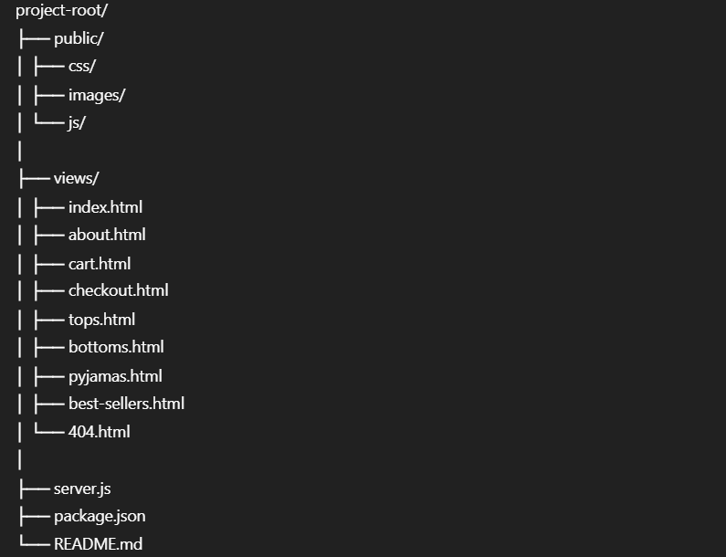

# Sulu E-commerce Project  
Assignment 2 – Part 1 

## Description
This project is a simple e-commerce web application developed as part of **Assignment 2 – Part 1** for the Web Technologies 2 course.  
The main goal of this assignment is to demonstrate server-side request handling using **Express.js**, including routing, middleware, and handling HTTP requests.The application represents an online store landing page where users can browse product categories. No database is used at this stage.

## Team Members
- Quralai — SE-2429  
- Aida — SE-2429  
- Perizat — SE-2429  
- Ayanat — SE-2429  

---

## Objectives
- Handle server-side requests using Express.js  
- Work with different routes and HTTP methods  
- Use middleware for request processing  
- Serve static HTML pages and assets  
- Handle unknown routes with a custom 404 page  

---

## Application Routes
- `GET /` — Home page  
- `GET /about` — About page  
- `GET /cart` — Shopping cart page  
- `GET /tops` — Tops category page  
- `GET /bottoms` — Bottoms category page  
- `GET /pyjamas` — Pyjamas category page  
- `GET /best-sellers` — Best sellers page  
- `GET /checkout` — Checkout page  
- All other routes — Custom **404 Page Not Found**

---

## Middleware
- `express.urlencoded({ extended: true })` — for handling form data  
- `express.static()` — for serving static files from the `public` folder  

---

## Project Structure

## installation & Run Instructions
Install project dependencies: npm install

- Start the Express server: node server.js

- Open the application in your browser: http://localhost:3000
